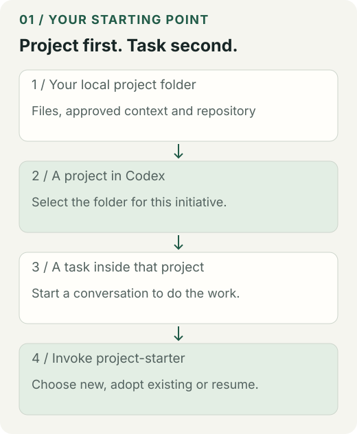
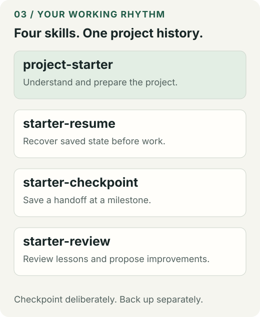
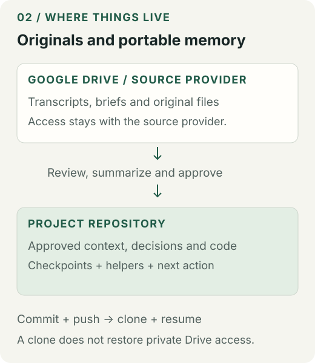

# Project Starter Kit

**Give your next session a place to pick up.**

Created by **Daniel Gonell** · v0.7.3 · Supervised pilot

Version-Timestamp: 2026-09-14 15:39:03 AST

A shared foundation for Codex and Claude Code projects. Bring an idea, an existing app, or a folder of approved context. The kit helps your AI organize the work, preserve decisions and save a handoff that travels with the project.

**Two ways in: paste this repository link, or install the plugin. Both use the same four skills and helpers.**

[Start now](#start-in-five-steps) · [AI instructions](START-HERE.md) · [Install](docs/install.md) · [Commands](docs/commands.md) · [Troubleshooting](docs/troubleshooting.md) · [Release verification](docs/releases.md)

> **For an AI receiving this repo URL:** read [START-HERE.md](START-HERE.md), then the canonical [project-starter skill](plugins/ide-project-starter/skills/project-starter/SKILL.md). Use this checkout as tooling. Preserve the user's application repository and history.

## Start in five steps



1. **Choose the project folder.** Keep any client or business context in its usual approved location. Select one initiative, such as a website or app.
2. **Open your AI workspace.** In Codex, create or select a project pointing to that local folder, then start a task inside it. In Claude Code, open a session in the folder.
3. **Paste the kit URL and your goal.** Use the message below. Add your application repo URL separately if needed.
4. **Review the setup preview.** The agent explains what it found, what it will add, what it will preserve and any missing access or conflicting instructions.
5. **Complete a small task and test recovery.** Save a checkpoint, start a fresh session and ask the agent to recover the objective and next action.

Copy this:

> Use https://github.com/newmindsgroup/project-starter-kit as this project's memory and organization foundation. Read README.md and START-HERE.md. Inspect my project and the context I provide, choose new setup, adoption or resume, and preserve my existing files, instructions and Git history. Preview the changes, implement within my authorized scope, save a checkpoint and verify recovery. Ask only for information you cannot safely infer.

Add your goal in plain English, for example:

> This is an existing website project. The app repo is [my app URL]. Meeting notes are in [approved source folder]. Help us continue the rebuild without losing current decisions.

The **kit URL supplies setup tools**. Your **application URL identifies the product repository**. The agent should not replace your app's remote with this repository or merge the kit's Git history into your app.

Public kit access does not provide access to your private application, Drive files or other services. The agent still needs the relevant local tools and your approved source access.

## Choose the path that fits

| What you have | What happens |
| --- | --- |
| An empty project folder | New setup creates project instructions, context records and a fresh identity. |
| An existing app or collection of documents | Adoption previews additive memory files and compatible instruction appends. Your application layout stays in place. |
| A project already using the kit | Resume recovers its saved state and flags changed or unavailable evidence. |
| An interrupted setup | Recovery uses the existing plan and records. It does not invent a new identity to bypass the interruption. |
| A different memory system or conflicting rules | The agent prepares a migration or companion-records plan before changing anything. |

The wizard includes a **read-only inspector** that suggests a route. It does not apply a template, install tools or prove that a framework works. The agent reviews its findings and uses the existing preview/apply helpers.

The foundation works with software and business/research profiles. It does not choose your product strategy or install every language runtime. Website frameworks, mobile tooling, databases and business execution belong to the project itself.

[Setup wizard details](plugins/ide-project-starter/core/docs/setup-wizard.md) · [Existing-project adoption](plugins/ide-project-starter/core/docs/adopt-existing.md)

## What is included?

| Part | Its job |
| --- | --- |
| **4 skills** | Guide setup, resume, checkpoint and learning review. |
| **Python helpers** | Inspect project state, preview changes, preserve identities, save records and verify recovery. |
| **Templates** | Create the project brief, context register, quality notes, workflow files and portable helpers. |
| **Plugin manifests** | Make the workflows discoverable in Codex and Claude Code. |
| **Human and AI guides** | Explain the same process at the right level of detail for each reader. |
| **Release manifest** | Identify the source version and verify every distributed file against recorded hashes. |

There is no separate AI model inside the plugin. Your existing Codex or Claude Code agent reads the skills and does the work.



| Skill | When to use it |
| --- | --- |
| `project-starter` | Start, adopt or resume from a selected project folder. |
| `starter-resume` | Recover saved work before continuing. |
| `starter-checkpoint` | Save decisions, progress, evidence, blockers and the next action. |
| `starter-review` | Examine lessons and propose improvements or skill drafts. |

You can ask in plain English. If your tool does not discover a skill automatically, the agent can read the corresponding local SKILL.md. The plugin identifier is always `ide-project-starter`; the entry skill is `project-starter`.

## Where information belongs



| Location | Keep here |
| --- | --- |
| **Drive, OneDrive or original provider** | Original transcripts, recordings, supplied documents, contacts and large assets. Preserve the source permissions. |
| **Your project's approved repository** | Code or suitable deliverables, reviewed context summaries, source references, decisions, checkpoints and setup definitions. |
| **Local tooling location** | Rebuildable environments, dependencies, caches and scratch files, outside synced folders where practical. |
| **Credential manager** | Passwords, tokens and keys. These do not belong in project memory or Git. |

A common arrangement:

```text
Approved source storage/
└── Client or business/
    ├── Shared context/
    └── Website/
        ├── Meeting notes/
        └── Supplied documents/

Local development workspace/
└── website/                    ← your application repo
    ├── existing application files
    ├── PROJECT.md
    ├── QUALITY.md
    ├── context/                ← reviewed summaries + source register
    ├── memory/                 ← saved checkpoints + learning records
    ├── .starter/               ← portable helpers and receipts
    ├── .agents/skills/
    └── .claude/skills/
```

This is an illustration, not a mandatory application layout. The kit checkout lives separately as tooling. A whole client archive should not become one application repository.

The agent reads approved material, distinguishes facts from proposals and records what it could not read. It synthesizes useful context into the project. It does not automatically copy raw transcripts or contracts into Git. Native Drive pointers and filenames are not proof that the document was read.

A private application repo can still have the wrong audience for internal notes. Use an approved private records location when necessary. Git ignore rules do not stop cloud-drive synchronization.

[Storage boundaries](plugins/ide-project-starter/core/docs/storage-boundaries.md) · [Context intake](plugins/ide-project-starter/core/docs/intake.md)

## What the memory actually saves

Each checkpoint records the objective, constraints, accepted decisions, completed work, recorded checks, blockers, next action, external-action notes and selected source evidence. Checkpoints link to prior records so the helper can detect certain changes or damaged chains.

**Saved memory is not perfect recall.** There is no background capture of every conversation. The agent must checkpoint meaningful work. Resume reports recorded claims; it does not rerun the application's tests or grant permission for external actions.

Local hashes can flag changed local evidence. They do not monitor remote Drive documents. A repo clone restores committed files, not cloud permissions, private originals or your installed tools.

## Your everyday rhythm

**Before work:** “Resume this project. What did we finish, what changed, and what is next?”

**At a milestone:** “Checkpoint our decisions, completed work, actual checks, blockers and next action.”

**For backup:** “Review the approved project files, then commit and push them to our project repo.”

**For improvement:** “Review this lesson and propose a fix or skill improvement. Keep private details local.”

A checkpoint is not a Git commit. A Git commit is not a push. The public starter-kit repository does not back up your own project.

For the first recovery test, compare the new session's recovered objective, decisions, last checks and next action with the checkpoint you saved. Missing evidence should remain visible.

## Install once, or use the link each time

- **Repository route:** paste the public URL. The agent obtains a separate checkout, reads the entry guide and prepares the local prerequisites. No global plugin installation is required.
- **Plugin route:** explicitly install the plugin in your chosen tool, start a fresh session and invoke its skills. Each project still needs its own setup or adoption.

Both routes require a local agent with file and command tools. A web chat that can only read pages cannot modify a local project.

**Prerequisites:** Python 3.10 or newer, the pinned Copier environment for initialization/adoption, and a supported filesystem. Existing project resume uses Python without Copier. Current initialization is a macOS/POSIX pilot with hard-link support; Windows initialization is unsupported and other systems need testing.

[Exact installation steps](docs/install.md) · [Technical recipes and input examples](docs/commands.md)

## Team use, improvements and drift

Use this public repo to distribute the kit to your team. Each team member works in their own approved project repository. Keep client records and personal project memory out of public issues and contributions.

The maintainer's private development repo is the single source of truth. This public repo receives generated releases from reviewed commits, including its public documentation. We do not maintain a separate implementation here. The release manifest records the source commit, version and file hashes. Public feedback is reviewed in the development workflow before a new release is generated.

A plugin update changes the shared workflows available for future use. It does **not** silently update helper copies in an existing project. Project upgrades use staged comparison, review and verification, preserving identity and customizations.

The learning workflow can record observations and propose a reusable skill. It does not retrain the AI, approve proposals, activate skills or upload private feedback automatically.

[Release and verification process](docs/releases.md) · [Contributing](CONTRIBUTING.md) · [Project upgrades](plugins/ide-project-starter/core/docs/project-upgrades.md)

## Readiness, limits and support

This is a **supervised pilot**, suitable for a careful first project with reviewed setup and recovery checks. [VALIDATION.md](VALIDATION.md) records this release's actual checks and outstanding acceptance work.

The kit is not a complete sensitive-data classifier, hostile-filesystem security boundary, distributed lock, unattended installer, full memory-system converter or application test runner. Do not run competing adoption writers against the same target. Preserve partial work and its plan when a command fails.

[Common problems and recovery](docs/troubleshooting.md) · [Report a sanitized issue](https://github.com/newmindsgroup/project-starter-kit/issues)

## Author and licensing

Created by **Daniel Gonell**, maintained through **New Minds Group**, with AI-assisted development. Upstream tools retain their own authorship and terms. See [AUTHORS.md](AUTHORS.md) and [NOTICE.md](NOTICE.md).

Released under the [MIT License](LICENSE). Files the kit places in your project are yours to use without carrying the kit's notice; see [LICENSING.md](LICENSING.md).
